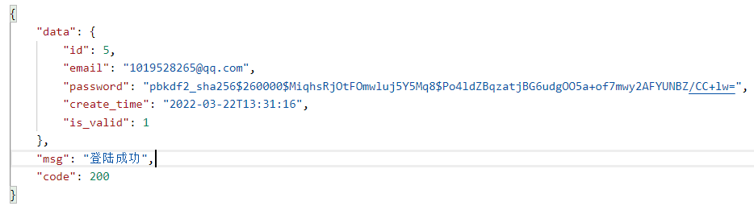
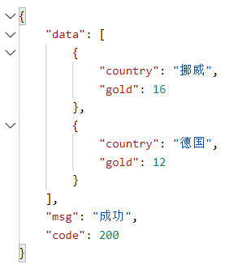

###外网启动命令:
    natapp -authtoken=5cb6b7200cf11ce3
#一.账户相关功能
    本模块现拥有四个接口:1.登录2.注册3.注销4.发送邮件获取验证码 

###1.登录:
    1.0 接口:ip地址:3000/account/login
    1.1 需要参数:
        邮箱账号:email 需要做检验是否为邮箱格式
        密码:password
    1.2 返回参数:
        成功:返回data: id;email;password;create_time;is_valid
            提示信息msg:登陆成功 状态码code:200
        失败1:返回data:0 提示信息msg:邮箱或者密码错误 状态码code:401
        失败2:返回data:0 提示信息msg:请输入邮箱或者密码 状态码code:402
    1.3 请求类型: POST
###2.注册:
    2.0 接口:ip地址:3000/account/register
    2.1 需要参数:
        邮箱账号:email 需要做检验是否为邮箱格式
        密码:password
        验证码:code
    2.2 返回参数:
        成功:返回data: id;email;password;create_time;is_valid
            提示信息msg:注册成功 状态码code:200
        失败1:返回data:0 提示信息msg:邮箱已注册 状态码code:401
        失败2:返回data:0 提示信息msg:验证码错误 状态码code:402
        失败3:返回data:0 提示信息msg:请输入完整的信息 状态码code:403
    2.3 请求类型: POST
###3.注销:
    3.0 接口:ip地址:3000/account/logout
    3.1 需要参数:
        正在登陆的邮箱账号:email 
    3.2 返回参数:
        成功:返回data:0 提示信息msg:注销成功 状态码code:200
        失败1:返回data:0 提示信息msg:注销失败 状态码code:401
        失败2:返回data:0 提示信息msg:您还未登录 状态码code:402
    3.3 请求类型: GET
###4.发送邮件:
    4.0 接口:ip地址:3000/account/mail
    4.1 需要参数:
        邮箱账号:email 需要做检验是否为邮箱格式
    4.2 返回参数:
        成功:返回验证码data:code 提示信息msg:邮件发送成功 状态码code:200
        失败1:返回data:0 提示信息msg:邮件发送失败 状态码code:401
        失败2:返回data:0 提示信息msg:请输入邮箱账号 状态码code:402
    4.3 请求类型: POST
#二.主界面相关功能
    本模块现拥有九个接口:
    返回数据格式大概为:

###1.国家奖牌数量排行:
    1.0 接口:ip地址:3000/sports/country_medal
    1.1 需要参数:
        年份:year 默认是2022
    1.2 返回参数:
        成功:返回data: 金牌数量国家:country1; 金牌数量:gold;总奖牌数量国家:country1; 总奖牌数量:total
            提示信息msg:成功 状态码code:200
        失败1:返回data:0 提示信息msg:请输入年份 状态码code:401
    1.3 请求类型: GET
###2.国家奖牌数量排行(详细):
    2.0 接口:ip地址:3000/sports/country_medal_detail
    2.1 需要参数:
        年份:year 默认是2022
        页码:page 默认是1
    2.2 返回参数:
        成功:返回data:国家:country;金牌数量:gold;银牌数量:silver;铜牌数量:bronze;总奖牌数量:total
            数据总量: total_data ;提示信息msg:成功 ;状态码code:200
        失败1:返回data:0 提示信息msg:请输入年份 状态码code:401
    2.3 请求类型: GET
###3.项目奖牌数量排行:
    3.0 接口:ip地址:3000/sports/sports_medal
    3.1 需要参数:
        年份:year 默认是2022
    3.2 返回参数:
        成功:返回data: 项目1:sport1; 总奖牌数量:total_count;
                       项目2:sport2; 金牌数量:gold_count;
            提示信息msg:成功 状态码code:200
        失败1:返回data:0 提示信息msg:请输入年份 状态码code:401
    3.3 请求类型: GET
###4.项目奖牌数量排行(详细):
    4.0 接口:ip地址:3000/sports/sports_medal_detail
    4.1 需要参数:
        年份:year 默认是2022
    4.2 返回参数:
        成功:返回data: 项目:sport;金牌数量:gold_count;银牌数量:silver_count;铜牌数量:bronze_count;总奖牌数量:total_count
            提示信息msg:成功 状态码code:200
        失败1:返回data:0 提示信息msg:请输入年份 状态码code:401
    4.3 请求类型: GET
###5.国家信息:
    5.0 接口:ip地址:3000/sports/country_message
    5.1 需要参数:
        年份:year 默认是2022
    5.2 返回参数:
        成功:返回data: 国家id:id; 国家代号:noc; 国家名称:country; 总数:total;
            提示信息msg:成功 状态码code:200
        失败1:返回data:0 提示信息msg:请输入年份 状态码code:401
    5.3 请求类型: GET
###6.运动员奖牌数量排行:
    6.0 接口:ip地址:3000/sports/athlete_medal
    6.1 需要参数:
        年份:year 默认是2022
    6.2 返回参数:
        成功:返回data: 运动员1:athlete1; 金牌数量:gold_count;
                       运动员2:athlete2; 总奖牌数量:total_count;
            提示信息msg:成功 状态码code:200
        失败1:返回data:0 提示信息msg:请输入年份 状态码code:401
    6.3 请求类型: GET
###7.运动员奖牌数量排行(详细):
    7.0 接口:ip地址:3000/sports/athlete_medal_detail
    7.1 需要参数:
        年份:year 默认是2022
        页码:page 默认是1
    7.2 返回参数:
        成功:返回data: 运动员:athlete;金牌数量:gold_count;银牌数量:silver_count;铜牌数量:bronze_count;总奖牌数量:total_count
            数据总量: total_data ;提示信息msg:成功 状态码code:200
        失败1:返回data:0 提示信息msg:请输入年份 状态码code:401
    7.3 请求类型: GET
###8.中国项目奖牌数量排行:
    8.0 接口:ip地址:3000/sports/china_medal
    8.1 需要参数:
        年份:year 默认是2022
    8.2 返回参数:
        成功:返回data: 总奖牌数量项目:sport1; 总奖牌数量:total_count ;金牌牌数量项目:sport2; 金牌数量:gold_count
            提示信息msg:成功 状态码code:200
        失败1:返回data:0 提示信息msg:请输入年份 状态码code:401
    8.3 请求类型: GET
###9.项中国项目奖牌数量排行(详细):
    9.0 接口:ip地址:3000/sports/china_medal_detail
    9.1 需要参数:
        年份:year 默认是2022
    9.2 返回参数:
        成功:返回data: 项目:sport;金牌数量:gold_count;银牌数量:silver_count;铜牌数量:bronze_count;总奖牌数量:total_count
        提示信息msg:成功 状态码code:200
        失败1:返回data:0 提示信息msg:请输入年份 状态码code:401
    9.3 请求类型: GET
#三.国家详细界面功能:
###1.国家奖牌信息展示:
    1.1 接口:ip地址:3000/country/medal_information
    1.2 请求类型: POST
    1.3 需要参数:
        年份:year 默认是2022
        国家id: country_id
    1.4 返回参数:
        成功:返回data: 国家名字:country_name;金牌数量:gold;
            银牌数量:silver;铜牌数量:bronze;总奖牌数量:total;
            提示信息msg:成功 状态码code:200
        失败1:返回data:0 提示信息msg:该国家在此届冬奥会未获得奖牌 状态码code:401
        失败2:返回data:0 提示信息msg:请输入正确的信息 状态码code:402
###2.国家详细项目获得奖牌:
    1.1 接口:ip地址:3000/country/medal_sports
    1.2 请求类型: POST
    1.3 需要参数:
        年份:year 默认是2022
        国家id: country_id
    1.4 返回参数:
        成功:返回data: 比赛名字:sport_name;金牌数量:gold;
            银牌数量:silver;铜牌数量:bronze;总奖牌数量:total;
            提示信息msg:成功 状态码code:200
        失败1:返回data:0 提示信息msg:该国家在此届冬奥会未获得奖牌 状态码code:401
        失败2:返回data:0 提示信息msg:请输入正确的信息 状态码code:402
###3.国家详细运动员获得奖牌:
    1.1 接口:ip地址:3000/country/medal_athlete
    1.2 请求类型: POST
    1.3 需要参数:
        年份:year 默认是2022
        国家id: country_id
    1.4 返回参数:
        成功:返回data: 运动员名字:athlete_name;金牌数量:gold;
            银牌数量:silver;铜牌数量:bronze;总奖牌数量:total;
            提示信息msg:成功 状态码code:200
        失败1:返回data:0 提示信息msg:该国家运动员在此届冬奥会未获得奖牌 状态码code:401
        失败2:返回data:0 提示信息msg:请输入正确的信息 状态码code:402
###4.国家强势项目:
    1.1 接口:ip地址:3000/country/top_sports
    1.2 请求类型: POST
    1.3 需要参数:
        年份:year 默认是2022
        国家id: country_id
    1.4 返回参数:
        成功:返回data: 比赛名字:sport;比赛描述:description;
        提示信息msg:成功 状态码code:200
        失败1:返回data:0 提示信息msg:该国家在此届冬奥会未获得奖牌 状态码code:401
        失败2:返回data:0 提示信息msg:请输入正确的信息 状态码code:402
###5.国家风云人物:
    1.1 接口:ip地址:3000/country/top_athlete
    1.2 请求类型: POST
    1.3 需要参数:
        国家id: country_id
    1.4 返回参数:
        成功:返回data: 运动员名字:name;运动员信息:information;
            运动员获得奖项:prize;运动员照片:picture;
            提示信息msg:成功 状态码code:200
        失败1:返回data:0 提示信息msg:该国家运动员在前八届冬奥会未获得奖牌 状态码code:401
        失败2:返回data:0 提示信息msg:请输入正确的信息 状态码code:402
###6.项目精彩时刻:
    1.1 接口:ip地址:3000/sports/moments
    1.2 请求类型: POST
    1.3 需要参数:
        比赛项目名称: sport_name
    1.4 返回参数:
        成功:返回data: 比赛名字:name;比赛描述1:describe1;比赛视频1:video1;比赛照片1:img1;
            比赛描述2:describe2;比赛视频2:video2;比赛照片2:img2;
            比赛描述3:describe3;比赛视频3:video3;比赛照片3:img3;
            提示信息msg:成功 状态码code:200
        失败1:返回data:0 提示信息msg:未查询到此比赛的精彩视频 状态码code:401
        失败2:返回data:0 提示信息msg:请输入比赛项目名称 状态码code:402
###7.奖牌预测:
    1.1 接口:ip地址:3000/country/predict
    1.2 请求类型: POST
    1.3 需要参数:
        国家id: country_id
    1.4 返回参数:
        成功:返回data: 国家名称:country_name;预测金牌:gold_count;
            预测银牌:silver_count;预测铜牌:bronze_count;
            提示信息msg:成功 状态码code:200
        失败1:返回data:0 提示信息msg:该国家在前八届冬奥会未获得奖牌,故无法预测 状态码code:401
        失败2:返回data:0 提示信息msg:请输入正确的信息 状态码code:402
